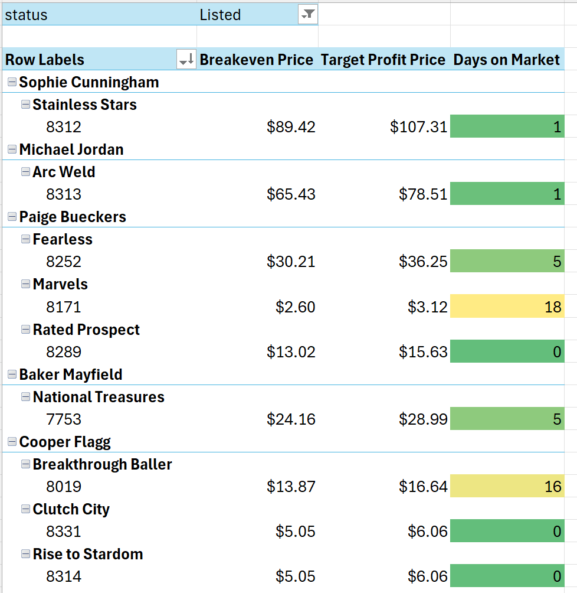
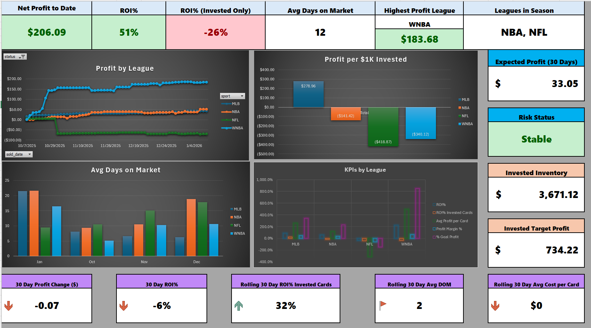

# ecommerce_profitability_analytics
This project documents the design of an end-to-end analytics system used to manage inventory, sales, shipping costs, and profitability for a live sports e-commerce business with frequent daily updates and real financial constraints.

# About Me
I am a systems engineer with a background in analytics, modeling, and data-driven decision-making. I have applied these skills across engineering, business, and personal projects, including the design of real-time analytics systems to support operational and financial decision-making for a small ecommerce business.

# Business Problem Statement
In the world of buying, collecting, and selling sports cards, there are many variables and factors that are not properly tracked or documented throughout the community. Small per-transaction errors can compound over time making margin protection and data accuracy critical to business viability. To accurately report and track the economic viability of sports card collecting and selling, this model serves as a real-time analytic tool that properly documents and analyzes inventory, sales, average time on market, and ROI. 

## Solution Architecture

Data is exported from eBay and internal inventory sources into a CSV, which is then ingested and validated via Python before being loaded into a PostgreSQL database that serves as the system of record. Business rules and guardrails, such as shipping costs, eBay fee logic, and inventory state transitions are enforced at the data layer to ensure margin accuracy. The curated data is then transformed using Excel Power Query, analyzed with DAX in the Excel data model, and surfaced through dashboards for ongoing profitability and operational decision-making. The data model refreshes automatically upon opening the file to ensure further ease of use. 

## Note on Code Abstraction

This repository includes representative Python modules that illustrate core business rules and validation logic used in the analytics system. Full production ETL scripts and database integrations are intentionally excluded to protect proprietary workflows. Two Python code snippets are included above but do not include any code specific to this system. They serve as information only. 

## Dashboard and Decision Making

The analytics system supports both operational and strategic decision-making across the inventory lifecycle.

**Operational View (Active Listings)**  
The first image illustrates a listing-level view used to guide daily pricing decisions. For each active item, the system calculates a true breakeven price and a target profit price based on purchase cost, fees, shipping, and grading. Days on market is surfaced alongside conditional formatting to highlight items that may require repricing or action. This view ensures pricing decisions are margin-aware and consistent rather than intuition-driven.

**Strategic View (Performance Dashboard)**  
The second image shows a portfolio-level dashboard that aggregates inventory and sales data to track profitability, capital efficiency, and risk over time. Metrics are segmented by category to identify performance drivers, while rolling 30-day indicators are used to reduce noise and surface emerging trends early. Negative or red indicators represent expected interim states in a live system (e.g., capital deployed before revenue realization) and are intentionally included to support risk awareness and proactive decision-making. This dashboard is representative of the early stages of a business in a volatile, mulit-billion-dollar sports card market. Decisions are made based on current sport trends, market pricing trends, and views surrounding major events. Early numbers are expected to fluctuate, but in-time, the business is expected to thrive as ROI% on invested cards is steadily increasing and the slow periods during the holidays have passed. 

All values shown are anonymized and included for illustrative purposes only.

# Future Development
This model is in continuous development. The start date of this business as a side hobby was 10.7.2025. Profit began rolling in immediately and I realized data analytics was necessary to become successful within this side business. The current time spent on this side hustle is ~1 hour per day. To minimize this even further, future developments to the model are needed such as :

- UI for updated inventory
- UI for card sales
- UI for placing card listings on the market
- Live dashboard with immediate updates connected to eBay sales
- Card QR label development for card shows to allow scanning for immediate card information and sale updates

