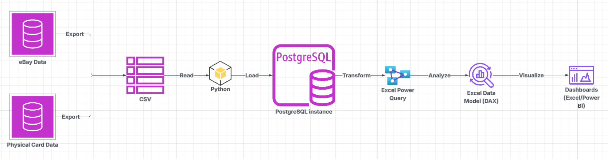

# ecommerce_profitability_analytics
This project documents the design of an end-to-end analytics system used to manage inventory, sales, shipping costs, and profitability for a live sports e-commerce business with frequent daily updates and real financial constraints.

# About Me
I am a former collegiate softball player from Tufts University where my team won 2 Conference Championships, attended 3 regional championships winning 1, and attended 1 World Series Championship. To go from a good player to a great player, I not only had to rely on my physical ability but my mental ability. I analyzed my craft through data. This allowed me to simplify my game by predicitng scenarios and anticipating my opponent's play. By relying on my instinct on the field and analytics off the field, I was able to achieve both great personal and team success. Upon graduation, I entered the real world working for a renowned energy company as a Systems Engineer where I continued to use my analytic skills to develop high fidelity technical models for analyzing various alternative energy source and pipeline scenarios. 
Unfortunately in May of 2025, I was involved in a very serious biking accident where I was struck by a vehicle that had drifted into the bike lane. I broke my spine and have spent the remaining months recovering physically. To get back to being an athlete, I was and am forced to rest and recover, something I was not used to as a very active person. However, I saw this as an oppotunity to get back into my hobbies. Guitar, coding, reading, and collecting sports cards. I have collected Yankees sports cards since I was a kid. But as an adult, I saw how much the business of collecting, buying, and selling has accelerted and saw a great business opportunity as someone who knows and can analyze sports very well. 

# Business Problem Statement
In the world of buying, collecting, and selling sports cards, there are many variables and factors that are not properly tracked or documented throughout the community. Small per-transaction errors can compound over time making margin protection and data accuracy critical to business viability. To accurately report and track the economic viability of sports card collecting and selling, this model serves as a real-time analytic tool that properly documents and analyzes inventory, sales, average time on market, and ROI. 

## Solution Architecture

# Future Development
This model is in continuous development. The start date of this business as a side hobby was 10.7.2025. Profit began rolling in immediately and I realized data analytics was necessary to become successful within this side business. The current time spent on this side hustle is ~1 hour per day. To minimize this even further, future developments to the model are needed such as :

- UI for updated inventory
- UI for card sales
- UI for placing card listings on the market
- Live dashboard with immediate updates connected to eBay sales
- Card QR label development for card shows to allow scanning for immediate card information and sale updates

